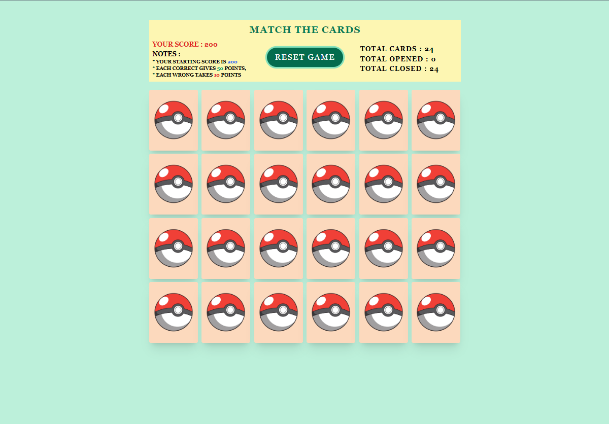

https://app.patika.dev/courses/react

# React Redux Card Game App
The card game is played with 12 cards which are shuffled and laid out in a grid face down. The player flips two cards to find a matching pair, and if successful, the cards remain face-up; otherwise, they are flipped back over. The game is over when all the cards have been matched.

## Technology stack

- React.js
- Redux
- tailwind.ui
- Confetti
