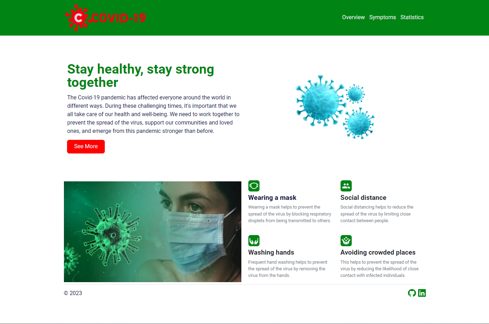

https://app.patika.dev/courses/react

# React Redux Covid 19 Tracker
The Covid 19 Tracker is a web application that shows the number of cases, deaths, and recoveries of Covid 19 in the world and in the country. The application is developed with React.js and Redux.

## Technology stack

- React.js
- Redux
- Redux-Toolkit
- React Router
- Bootstrap