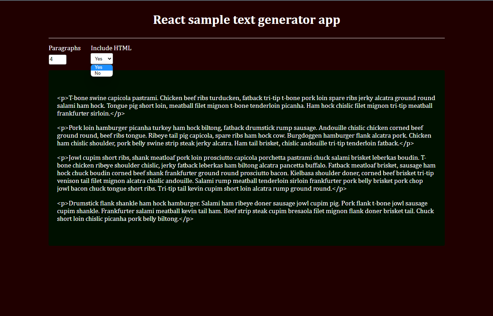

https://app.patika.dev/courses/react

# React Redux Sample Text Generator
The project is a text generator app created using React and Redux. It shows 4 paragraphs initially and lets users adjust the number of paragraphs using an input. Users can choose to display paragraphs as text or HTML through a dropdown and select at least one paragraph. The page has a user-friendly interface for easy customization of the number of paragraphs, and offers visual variety through different display options.

### TECHNOLOGIES

- Axios
- Redux
- Redux Toolkit
- Styled Components
