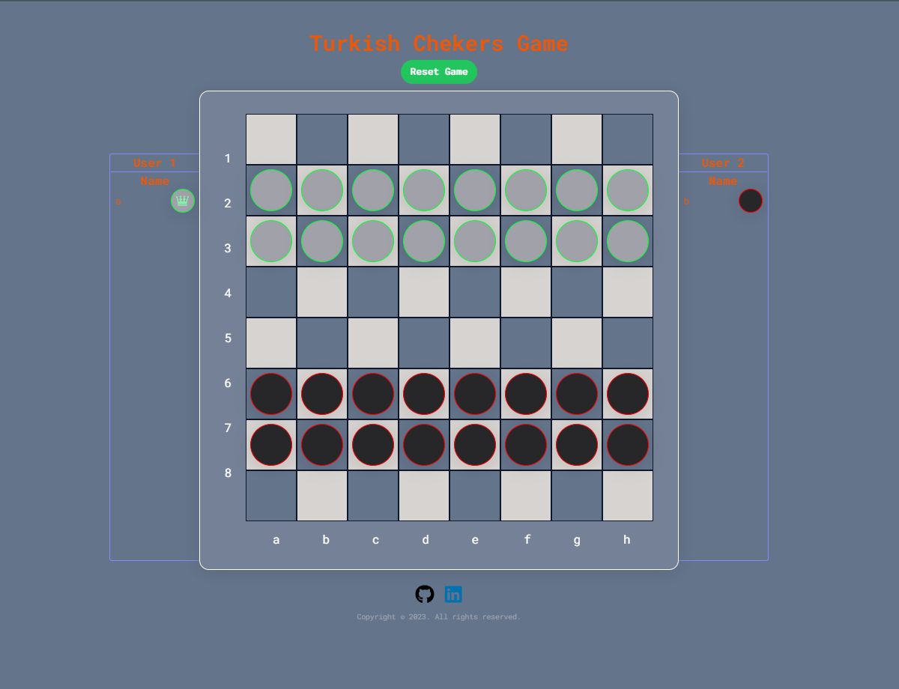

https://app.patika.dev/courses/react

# React Redux Turkish-Checkers-App
The project is a Turkish Checkers game created using React and Redux. It is a two-player game. The game is played on a 8x8 board and by two players, one with black pieces and one with white pieces. The game is played by moving the pieces diagonally. The goal of the game is to capture all of the opponent's pieces or make them unable to move. The game is over when one player captures all of the opponent's pieces or when neither player can move. The game has a user-friendly interface for easy customization of the number of pieces, and offers visual variety through different display options.

### TECHNOLOGIES

- React
- Redux
- Tailwind UI
- React Confetti
