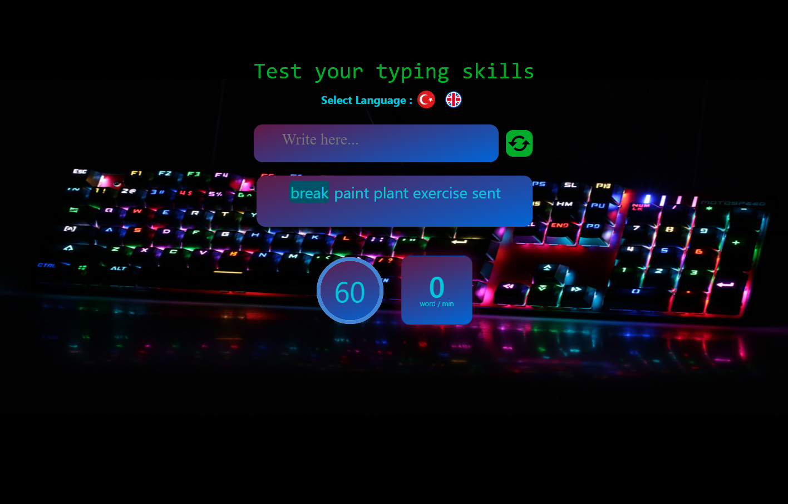

https://app.patika.dev/courses/react

# React Redux Type Speed App
This app is designed to test users' ability to correctly spell randomly generated complex words within a given period of time. The user is given 60 seconds and the countdown starts when any character is entered when the time starts.
Words are displayed side by side on the screen, and each word the user enters is shown in green if correct and red if incorrect. Every time the user enters the wrong word, the program displays a warning message in red and reminds them to enter the correct word.
There is a "Restart" button so that the game can be restarted. By clicking this button, the game can be restarted and the user can take the word typing test again.
When the 60 second time is up, the results are shown to the user. These results include number of correct and incorrect words, percentage of correct words, and elapsed time.
This app requires users to think quickly and type the right words quickly. It also offers users the opportunity to test their ability to spell words correctly in a given time period.

## Technology stack

- React.js
- Redux
- Redux-Toolkit
- React-Bootstrap
- React-Countdown
