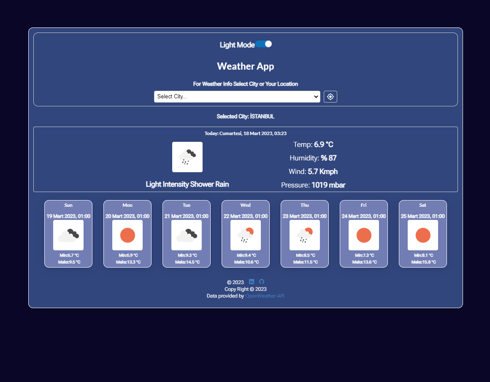

https://app.patika.dev/courses/react

# React Redux Weather App
The project is a weather application that shows the weather of the city you search for. The project is developed with React.js and Redux. The project is developed with the help of the OpenWeatherMap API.

## Technology stack

- React.js
- Redux
- Redux-Toolkit
- Semantic-ui-react