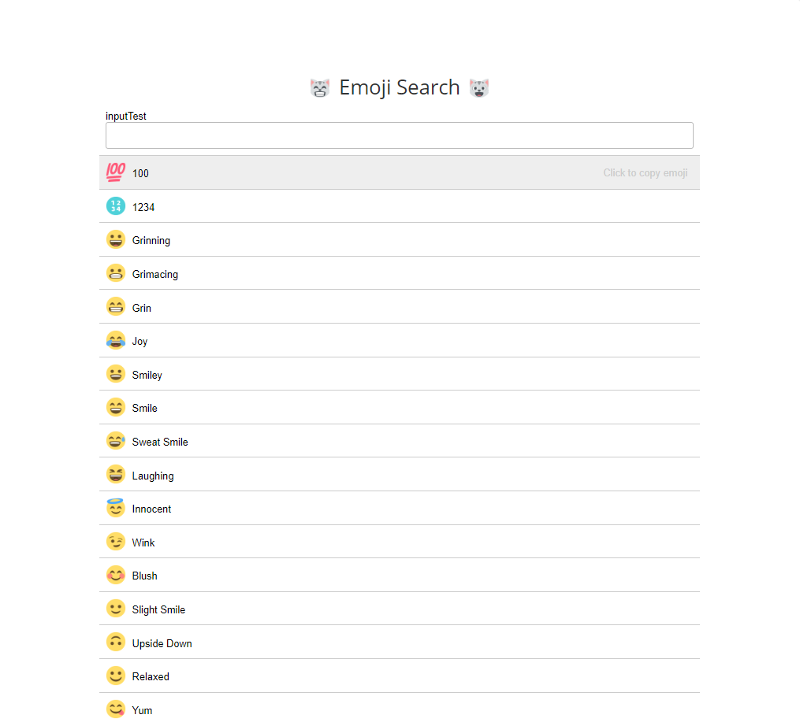
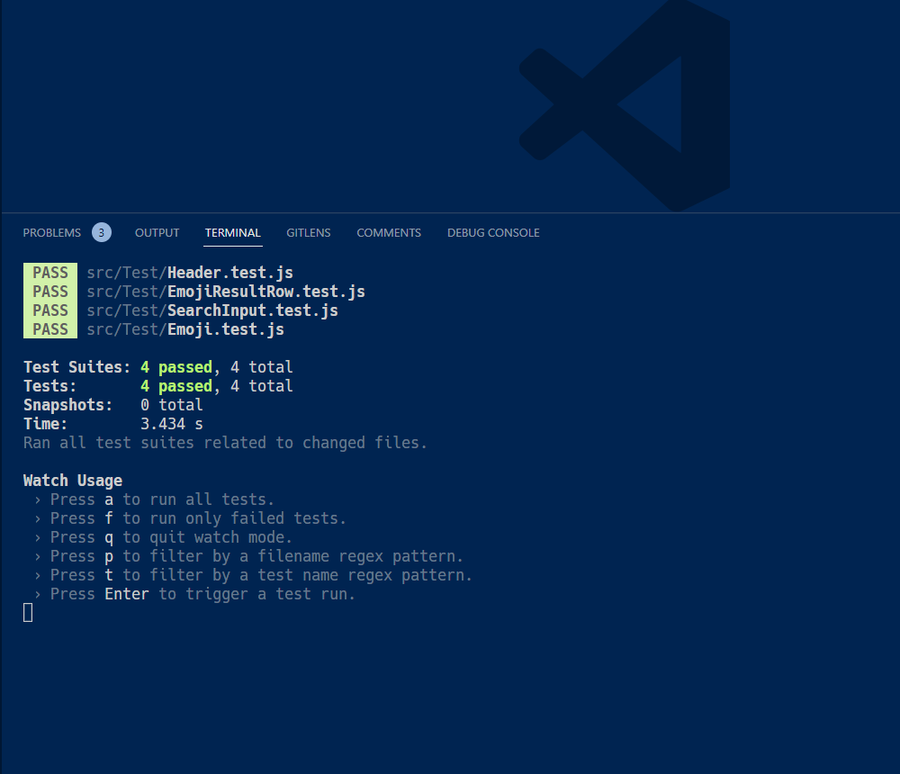

https://app.patika.dev/courses/react

# React Test - Emoji Search
I've written test code for an already running app in the sample project shared in React's own docs.

## Project Description
- The app is a simple emoji search app.
- The app has a header and a list of emojis.
- The app has a search bar that filters the emojis according to the entered text.
- When you click on any emoji, it is copied to the clipboard.
- The app has a filter button that filters the emojis according to their categories.
- The app has a test file for each component.
- The test code is written for each component.

## Project Setup
- Create a new React app.
- Install the necessary dependencies.
- Create a Header component.
- Create an EmojiList component.
- Create an Emoji component.
- Create a SearchBar component.
- Create a CopyButton component.
- Create a Filter component.
- Create a test file for each component.
- Write the test code for each component.

## Project Details
### Header
- The Header component is a functional component.

### EmojiList
- The EmojiList component is a functional component.
- The EmojiList component has a list of emojis.
- The EmojiList component has a search bar.
- The EmojiList component has a filter button.
- The EmojiList component has a copy button.

### Emoji
- The Emoji component is a functional component.
- The Emoji component has an emoji.
- The Emoji component has a name.

### SearchBar
- The SearchBar component is a functional component.
- The SearchBar component has a search bar.

### CopyButton
- The CopyButton component is a functional component.
- The CopyButton component has a copy button.

### Filter
- The Filter component is a functional component.
- The Filter component has a filter button.

### Test
- The test file for each component is created.
- The test code is written for each component.

### Test Results

## Project Setup
-- `npm install` to install dependencies
-- `npm start` to run